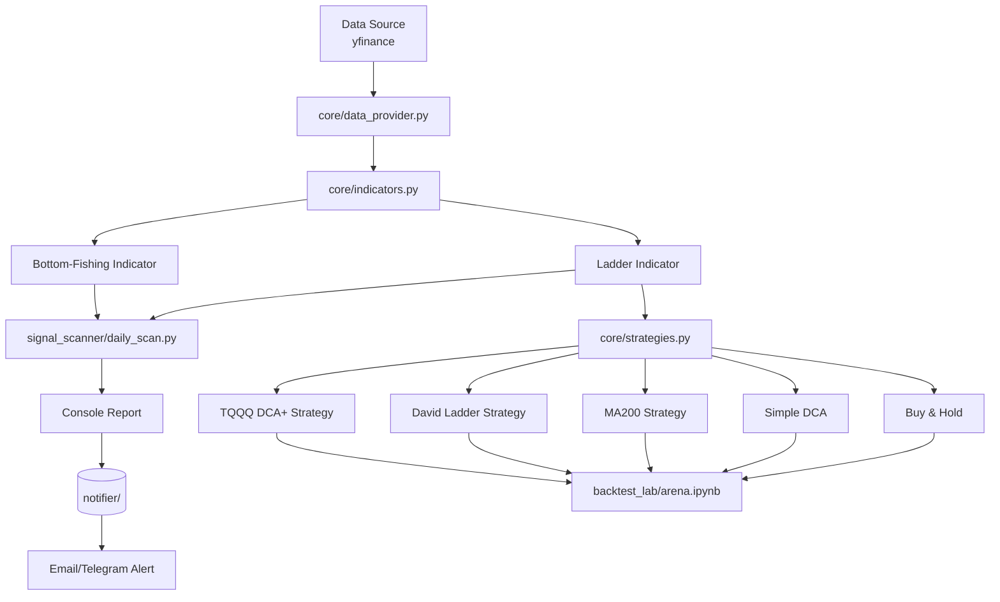

# Stock Notifier – Personal Trading Assistance System

> **Note for AI Collaborators**  
> This repository is a work‑in‑progress personal trading‑assistance system. It is designed as a modular Python framework that separates **data fetching**, **indicator calculation**, **strategy simulation**, and **reporting**. The goal is to provide a flexible platform for backtesting, daily signal scanning, and (future) automated notifications.

## 🏗️ Project Structure

```
stock_notifier/
├── backtest_lab/          # Interactive backtesting arena (Jupyter notebooks & scripts)
│   ├── arena.ipynb        # Compare multiple strategies with interactive widgets
│   ├── interactive_research.ipynb  # Parameter tuning for ladder strategy
│   ├── tqqq_backtest.py   # Advanced DCA‑plus‑profit‑taking strategy (TQQQ‑specific)
│   ├── march_may_backtest.py  # 4‑hour data backtest with bottom‑fishing signals
│   └── verify_indicators.py   # Visual verification of ladder & bottom‑fishing indicators
├── core/                  # Core Python library (reusable across all components)
│   ├── data_provider.py   # yfinance wrapper for historical data
│   ├── indicators.py      # Technical indicators (ladder, bottom‑fishing)
│   └── strategies.py      # Strategy base class and five concrete strategies
├── signal_scanner/        # Daily signal scanner
│   └── daily_scan.py      # Scans watchlist for ladder breakouts & bottom‑fishing signals
├── config/
│   └── watchlist.json     # Watchlist symbols and ladder settings
├── notifier/              # (Planned) Daily report and alert system
├── legacy/                # Previous working system (daily reports, warnings, earnings)
└── requirements*.txt      # Python dependencies
```

## 🧠 Engineering Overview

### 1. Core Library (`core/`)
The heart of the system. All three main components (backtesting, scanning, notifier) rely on these modules.

- **`data_provider.py`**: Simple wrapper around `yfinance`. Fetches historical OHLCV data and returns a cleaned pandas DataFrame.
- **`indicators.py`**: Contains the `TechnicalIndicators` class that provides static methods for adding technical indicators to a DataFrame. The current implementation includes **ladder** (dual‑EMA channels) and **bottom‑fishing** (MACD‑based divergence) indicators, but the class is designed to be extended with new indicators.
- **`strategies.py`**: Abstract base class `BaseStrategy` that enforces a common interface (`run(df)`). Concrete strategies (Buy & Hold, Simple DCA, MA200, David Ladder, TQQQ DCA+) are implemented as subclasses. **Strategies are meant to be changed often**; the framework makes it easy to add new ones.

### 2. Backtesting Arena (`backtest_lab/`)
A collection of Jupyter notebooks and scripts for interactive strategy research.

- **`arena.ipynb`**: The main entry point for comparing strategies. Uses `ipywidgets` to select ticker, date range, and strategy. Runs the chosen strategy via `core/strategies.py` and plots equity curves.
- **`interactive_research.ipynb`**: For fine‑tuning ladder‑strategy parameters (N1, N2, take‑profit multiplier).
- **`tqqq_backtest.py`**, **`march_may_backtest.py`**: Stand‑alone scripts that implement specialized strategies. They can be run directly or imported as examples.
- **`verify_indicators.py`**: Utility script that plots the ladder and bottom‑fishing indicators for visual verification.

**Key Engineering Concept**: The arena is **not** a production backtester; it’s a **research sandbox**. You modify parameters in the notebooks, run cells, and immediately see results. The actual strategy logic lives in `core/strategies.py`, so changes there propagate to the arena.

### 3. Signal Scanner (`signal_scanner/`)
A daily scanner that checks the watchlist for actionable signals.

- **`daily_scan.py`**: Loads `config/watchlist.json`, fetches recent data via `core/data_provider.py`, computes ladder and bottom‑fishing indicators, and prints a formatted report.
- **Output includes**: For each symbol, the ladder status (Blue/Yellow, Top/Bottom), bottom‑fishing signals (strict/relaxed), and a summary of actionable signals.

**How it works**: The scanner is a **stand‑alone script** meant to be run once per day (e.g., via cron). It does not store state; it only prints today’s signals. Future integration with the notifier will send these signals via email/Telegram.

### 4. Notifier (`notifier/`)
**Currently empty**. The plan is to build a module that:
1. Receives signals from the scanner.
2. Formats them into a human‑readable report.
3. Sends the report via a chosen channel (email, Telegram, etc.).

The notifier will be the **final piece** that turns the system into a fully automated daily assistant.

## 🚀 How to Launch Each Component

### Prerequisites
```bash
# Install core dependencies
pip install -r requirements.txt

# For development (Jupyter, matplotlib, etc.)
pip install -r requirements-dev.txt
```

### 1. Launch the Backtesting Arena
```bash
cd /Users/zhijiezh/Files/Projects/stock_notifier
jupyter notebook backtest_lab/arena.ipynb
```
- Open the notebook in your browser.
- Run all cells (Kernel → Restart & Run All).
- Use the interactive widgets to select ticker, date range, and strategy.
- The notebook will call the appropriate strategy from `core/strategies.py` and display equity curves, metrics, and trade logs.

**If you want to test a new strategy**:
1. Add your strategy class to `core/strategies.py` (inherit from `BaseStrategy`).
2. Import it in `arena.ipynb` and add it to the strategy dropdown.
3. Re‑run the relevant cells.

### 2. Run the Daily Signal Scanner
```bash
cd /Users/zhijiezh/Files/Projects/stock_notifier
python signal_scanner/daily_scan.py
```
The script will:
- Load `config/watchlist.json`.
- Fetch the latest data for each symbol.
- Compute ladder and bottom‑fishing indicators.
- Print a report like:
  ```
  === Daily Signal Scan (2025‑02‑21) ===
  TQQQ: BLUE LADDER TOP breakout, STRICT BOTTOM‑FISHING signal
  NVDA: Inside BLUE ladder, no bottom signal
  ...
  ```

**To modify the watchlist or ladder settings**: Edit `config/watchlist.json`.

### 3. Verify Indicators (Debugging)
```bash
python backtest_lab/verify_indicators.py
```
This script plots the ladder and bottom‑fishing indicators for a hard‑coded symbol (TQQQ). Use it to visually confirm that the indicator calculations are correct.

### 4. Run Legacy System (Optional)
The `legacy/` folder contains the previous version of the system, which generated daily reports with warnings and earnings detection. It is kept for reference but is not actively maintained. To run it:
```bash
python legacy/daily_report.py
```

## 🔧 Development Workflow

### Adding a New Strategy
1. Create a new class in `core/strategies.py` that inherits from `BaseStrategy`.
2. Implement the `run(df)` method. The method should return a DataFrame with at least an `Equity` column.
3. (Optional) Add the strategy to the dropdown in `backtest_lab/arena.ipynb`.
4. Test your strategy in the arena notebook.

### Adding a New Indicator
Indicators are designed to be changed or added easily. Follow these steps:

1. **Define the indicator logic** as a static method in `core/indicators.py` inside the `TechnicalIndicators` class.
   - The method should accept a DataFrame (`df`) and any necessary parameters.
   - It should add new columns to `df` (e.g., `df['my_indicator'] = ...`).
   - Return the modified DataFrame.

2. **Integrate the indicator** into the components that need it:
   - **Scanner**: Update `signal_scanner/daily_scan.py` to call your new indicator method and include its signals in the report.
   - **Strategies**: If a strategy uses the indicator, import `TechnicalIndicators` and call the method in the strategy’s `run` method.
   - **Verification**: Optionally add a plot to `verify_indicators.py` to visually verify the new indicator.

3. **Test the indicator**:
   - Run `verify_indicators.py` to see a visual plot.
   - Run the scanner to ensure the indicator appears in the daily report.
   - Backtest a strategy that uses the indicator to confirm it affects trades as expected.

**Example**: Adding a simple moving‑average crossover indicator would involve creating `TechnicalIndicators.add_ma_crossover(df, short=10, long=50)` and then updating the scanner and/or strategies to use it.

### Modifying Existing Indicators
- Edit the corresponding static method in `core/indicators.py`.
- After making changes, run `verify_indicators.py` to see the visual effect.
- Update the scanner (`daily_scan.py`) if the signal logic changes.
- Ensure any strategy that depends on the indicator still works correctly (test in the arena notebook).

### Extending the Scanner
- The scanner currently only prints to console. To add persistence, modify `daily_scan.py` to write results to a file or database.
- To integrate with the notifier, you can import the scanner’s functions and call them from a notifier script.

### Building the Notifier
1. Create a new module under `notifier/` (e.g., `notifier/telegram_bot.py`).
2. Design an interface that takes the scanner’s output and sends it via your chosen channel.
3. Create a main entry point (e.g., `notifier/run.py`) that orchestrates scanning → formatting → sending.

## 📈 Current Engineering State

### ✅ What Works
- **Core library**: Data provider, indicators, and strategy base class are stable.
- **Backtesting arena**: Fully interactive; strategies can be compared side‑by‑side.
- **Signal scanner**: Daily scan produces correct signals for the watchlist.
- **Legacy system**: Previous version still runs and generates daily reports.

### 🚧 Missing / To‑Do
- **Notifier module**: Empty directory. No automation for sending alerts.
- **Unified pipeline**: No single script that runs scanner → notifier.
- **Deployment**: No cron job or serverless setup for daily execution.
- **Testing**: No unit or integration tests.
- **Error handling & logging**: Minimal.
- **Data caching**: Repeated yfinance calls may hit rate limits.

### 🔮 Suggested Engineering Next Steps
1. **Implement the notifier** (e.g., using SMTP or Telegram Bot API).
2. **Create a main orchestrator** (`run.py`) that chains scanner and notifier.
3. **Add scheduling** (cron) or serverless deployment (AWS Lambda).
4. **Write tests** for `core/indicators.py` and `core/strategies.py`.
5. **Add data caching** (e.g., cache yfinance responses to avoid rate limits).
6. **Improve logging** (structured logs, error reporting).

## 🧩 System Architecture



## 📚 Dependencies

Key Python packages (see `requirements.txt`):
- `yfinance` – stock data
- `pandas`, `numpy` – data manipulation
- `matplotlib` – plotting
- `jupyter`, `ipywidgets` – interactive notebooks
- `ta` (technical‑analysis library) – used in legacy code

## 🛠️ For AI Agents (Future Contributors)

If you are an AI agent asked to extend this repository, please:

1. **Read this README first** to understand the engineering layout.
2. **Check the `core/` modules** before modifying any logic.
3. **Update the watchlist** in `config/watchlist.json` if adding new symbols.
4. **Test your changes** in the appropriate notebook (`backtest_lab/arena.ipynb`).
5. **Keep the documentation** up‑to‑date.

**Remember**: Strategies and indicators are meant to be changed often; the framework is designed to make that easy. Focus on improving the **engineering infrastructure** (data pipeline, error handling, deployment) rather than optimizing a particular strategy or indicator.

## 📄 License

Personal project – no explicit license.

---

*Last updated: 2026‑02‑21*  
*Maintained by: zhijiezh*  
*Purpose: Personal trading assistance*